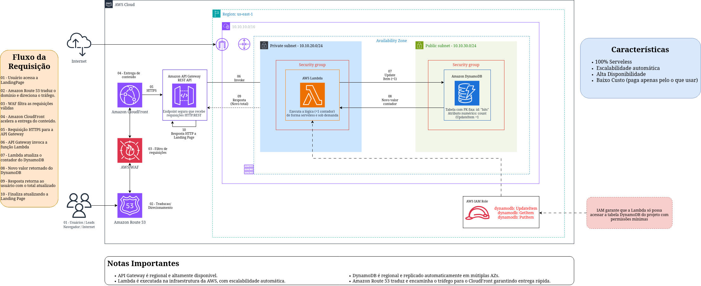

# 🚀 Contador de Acessos Serverless (Case 1)

**Projeto de Conclusão de Curso - EdN BRSAO231**

Este repositório contém a infraestrutura como código (IaC), front-end e lógica de backend para uma aplicação de contagem de acessos 100% Serverless hospedada na nuvem AWS.

---

## 🎯 O Desafio e Contexto do Projeto

Uma startup de marketing está lançando uma campanha para um novo produto através de uma página de captura ("Em Breve"). O objetivo é registrar um contador simples e confiável de quantas pessoas demonstraram interesse.

O grande desafio técnico é a **imprevisibilidade do tráfego**: a página pode receber de 10 a 1 milhão de acessos simultâneos. Hospedar isso em servidores tradicionais traria riscos de indisponibilidade (quedas no pico) ou custos ociosos altos. A solução adotada foi uma arquitetura **Serverless** orientada a eventos, com forte proteção de borda.

### Stakeholders
* **Equipe de Marketing:** Precisa de dados confiáveis e em tempo real.
* **Usuários Finais (Leads):** Esperam carregamento rápido e sem travamentos.
* **Time de Tecnologia/Finanças:** Exige custo proporcional ao uso (pagar apenas pelo que usar) e baixa manutenção.

---

## 🏗️ Arquitetura da Solução

Nossa arquitetura foi desenhada para garantir escalabilidade automática, segurança contra ataques web, entrega acelerada e observabilidade completa. Toda a infraestrutura foi provisionada utilizando o **AWS CDK** (Cloud Development Kit).



### 🔄 Fluxo de Dados da Requisição

1. **Acesso do Usuário:** O usuário final acessa a Landing Page "Em Breve" via navegador.
2. **Resolução de DNS:** O **Amazon Route 53** traduz o domínio e faz o direcionamento.
3. **Filtragem de Segurança:** O **AWS WAF** inspeciona o tráfego de entrada e bloqueia ameaças.
4. **Entrega de Conteúdo (CDN):** O **Amazon CloudFront** acelera a entrega global do conteúdo em cache.
5. **Requisição HTTP/HTTPS:** A requisição segura é encaminhada ao **Amazon API Gateway**.
6. **Invocação da Lógica:** O API Gateway aciona a função **AWS Lambda**.
7. **Processamento e Permissões:** O Lambda inicia a execução. O **AWS IAM** valida se a função possui o privilégio mínimo para operar.
8. **Retorno do Banco de Dados:** O **Amazon DynamoDB** localiza a *Partition Key* `id: hits`, incrementa o valor (`UpdateItem: +1`) e retorna o total.
9. **Resposta ao Usuário:** O Lambda devolve a contagem pelo caminho reverso até o front-end.
10. **Finalização:** A página é atualizada em tempo real com o número de acessos. Paralelamente, logs e métricas são registrados no **Amazon CloudWatch**.

---

## 🛠️ Componentes e Serviços AWS

| Serviço | Função na Arquitetura |
| :--- | :--- |
| **Amazon Route 53** | Gerenciamento de DNS, traduzindo o domínio e roteando o tráfego inicial. |
| **AWS WAF** | Proteção de borda contra explorações e tráfego malicioso (Segurança). |
| **Amazon CloudFront** | CDN que faz o cache da aplicação, garantindo baixa latência global. |
| **Amazon API Gateway** | Porta de entrada RESTful que recebe as requisições e invoca o backend. |
| **AWS Lambda** | Computação Serverless onde reside a lógica de incremento do contador. |
| **Amazon DynamoDB** | Banco de dados NoSQL altamente escalável que armazena a contagem. |
| **AWS IAM** | Gerenciamento de permissões (Security Roles) garantindo o privilégio mínimo. |
| **Amazon CloudWatch** | Observabilidade, captura de logs de execução e monitoramento de métricas. |
| **AWS CDK** | Framework utilizado para provisionar toda essa infraestrutura como código (IaC). |

---

## 📁 Estrutura do Repositório

O projeto foi organizado separando claramente a infraestrutura, a aplicação e as documentações:

```text
/
├── assets/                  # Arquivos de mídia e diagramas
│   └── Arquitetura_Case_1.jpg   
├── cdk/                     # Código de infraestrutura (AWS CDK em Python/TS)
│   ├── app.py               
│   └── stack.py             
├── src/                     # Código-fonte das aplicações
│   └── backend/             # Código da função Lambda (lambda_function.py e requirements.txt)
├── docs/                    # Documentação extra e PDF da apresentação final
├── .gitignore               # Controle de exclusões do repositório (node_modules, .venv, chaves, etc.)
└── README.md                # Documentação principal do projeto
```

---

## ⏱️ Metodologia e Sprints

O projeto foi gerenciado utilizando metodologia ágil (Scrum/Kanban) através do Jira.

* **Sprint 1 (Fundação):** Configuração de repositório, inicialização do CDK e criação da tabela DynamoDB.
* **Sprint 2 (Borda e Lógica):** Configuração de DNS (Route 53), CDN (CloudFront), Segurança (WAF), desenvolvimento do Lambda e API Gateway.
* **Sprint 3 (Testes e Monitoramento):** Testes de carga, implementação de observabilidade com CloudWatch e documentação final.

---

## 👥 Equipe do Projeto

| Integrante | Papel e Responsabilidades |
| :--- | :--- |
| **Alan de Sant'Anna Rodrigues** | Desenvolvedor AWS/Lambda e IAM |
| **George Silva Monteiro** | Especialista em Banco de Dados/DynamoDB |
| **Iago dos Santos Vila Real** | Arquiteto Cloud e Testes Integração |
| **Lauro Francisco da Silva** | Gestão Ágil e Arquiteto Cloud |
| **Natalia Aparecida Gadelha** | Gestão Ágil e Arquiteto Cloud/CDK |
| **Welder Souza Ferreira Cunha** | Arquiteto Cloud/CDK |

---

## 💻 Como Executar o Projeto (Deploy via CDK)

### Pré-requisitos
* [AWS CLI](https://aws.amazon.com/cli/) configurado.
* [Node.js](https://nodejs.org/) instalado.
* AWS CDK instalado (`npm install -g aws-cdk`).

### Passos

1. Clone o repositório:
```bash
   git clone [https://github.com/laurofrancisco/aws-serverless-access-counter.git](https://github.com/laurofrancisco/aws-serverless-access-counter.git)
   cd aws-serverless-access-counter 
``` 
2. Instale as dependências na pasta do cdk:

```bash
cd cdk
npm install # ou pip install -r requirements.txt
``` 

3. Realize o deploy na sua conta AWS:

```bash
cdk bootstrap
cdk deploy
``` 
4. Para evitar custos após os testes, destrua os recursos:

```bash
cdk destroy
``` 

Desenvolvido para a formação EdN. Data: 12/06/2026.